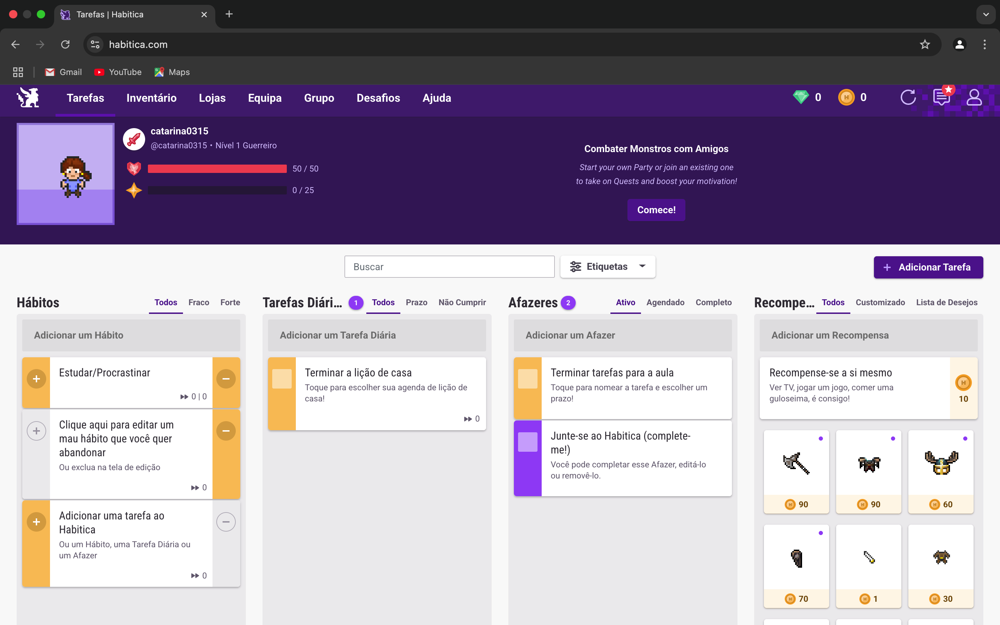
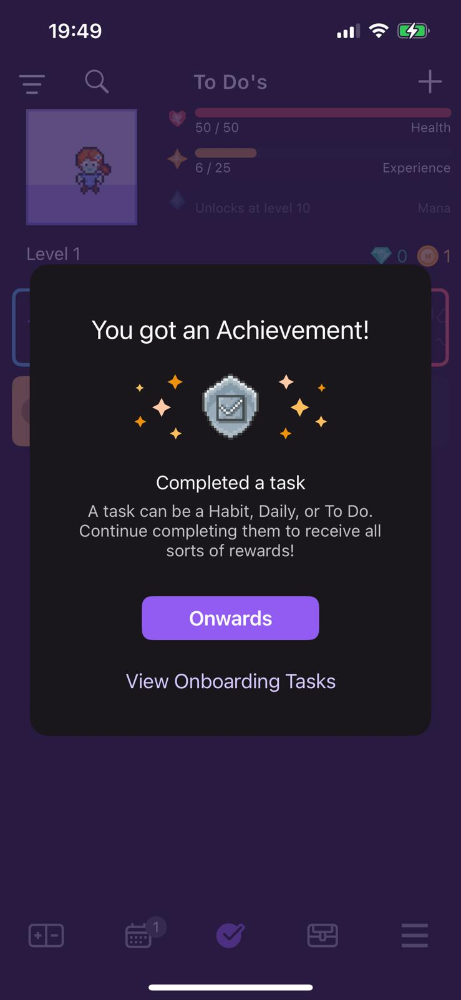

# Competitor Analysis: [Habitica] 
## General Information 
- **Name of System:** [Habitica] 
- **Company/Developer:** [HabitRPG, Inc.] 
- **Website/Product Page:** [[https://habitica.com](https://habitica.com)]
- **Version/Release Date:** [January 30, 2013] 
- **Platform(s) Supported:** [iOS/Android; Web] 
- **Target Audience:** [Anyone] 

--- 
## Core Functionality 

**Primary Purpose:** 
The app uses a game in which you have to keep an avatar alive and, as you complete tasks, you earn XP to level up and also earn gold coins to ustomize your avatar.

**Key Features:** 
- ***Create Tasks:*** You can create 3 types of tasks: Habits, Dailies and To Do's. You can create as many tasks as you want about anything and customize them with difficulty level to increase or decrease the XP they will give;
  
- ***Complete Tasks:*** After you create the tasks you can complete them and receve XP which was previously stipulated;
  
- ***Create Challenges with other users:*** After joining a team with other users you can create a challenge task with them.

**Unique Selling Points (USPs):**
- ***Gamifies tasks with RPG mechanics:*** The purpose of the app is a game in which you have to keep the avatar alive by completing tasks;
- ***XP to level up:*** When you complete a task, XP is given to level up and earn gold coins to customize your avatar;
- ***Team Challenges:*** You can create a challenge task with other users inside a team.

**Limitations/Weaknesses:**
- ***The Asthetics:*** We didn't find the aesthetics of the application very appealing;
- ***Confusing for Beginners:*** Even with the information that is given when you enter the app, its operation is still quite confusing;
- ***Avatar Customization:*** The avatar customization is too limited since this is the main differentiator of the app;

---

## Screenshots
<div style="display: flex; justify-content: center; gap: 20px;">
  <div style="text-align: center;">
    
    <p style="text-align: center;">Website's Homepage</p>
  </div>

  <div style="text-align: center;">
    
    <p style="text-align: center;">App's Homepage</p>
  </div>
</div>

<div style="clear: both;"></div>

<div style="display: flex; justify-content: center; gap: 20px;">
  <div style="text-align: center;">
    
    <p style="text-align: center;">How to create any tasks on the Website</p>
  </div>
</div>

<div style="clear: both;"></div>

<div style="display: flex; justify-content: center; gap: 20px;">
  <div style="text-align: center;">
    
    <p style="text-align: center;">How to create a Habit in the App</p>
  </div>

  <div style="text-align: center;">
    
    <p style="text-align: center;">How to create a Daily in the App</p>
  </div>

  <div style="text-align: center;">
    
    <p style="text-align: center;">How to create a To Do in the App</p>
  </div>
</div>

<div style="clear: both;"></div>

<div style="display: flex; justify-content: center; gap: 20px;">
    <div style="text-align: center;">
    
    <p style="text-align: center;">After completing a task on the Website</p>
  </div>

  <div style="text-align: center;">
    
    <p style="text-align: center;">After completing a task in the App</p>
  </div>
</div>

<div style="clear: both;"></div>

<div style="display: flex; justify-content: center; gap: 20px;">
    <div style="text-align: center;">
    
    <p style="text-align: center;">How to Create a Challenge with other users</p>
  </div>

  <div style="text-align: center;">
    
    <p style="text-align: center;">You can only create a challenge with other users on the Website</p>
  </div>
</div>

<div style="clear: both;"></div>

<div style="display: flex; justify-content: center; gap: 20px;">
    <div style="text-align: center;">
    
    <p style="text-align: center;">How to Customize your Avatar on the Website</p>
  </div>

  <div style="text-align: center;">
    
    <p style="text-align: center;">How to Customize your Avatar on the App</p>
  </div>
</div>


## Online Reviews
### Trustpilot: [https://www.trustpilot.com/review/habitica.com](https://www.trustpilot.com/review/habitica.com) 
* #### Life is a game
Melanie Yorke, Aug 10, 2024

*5/5*

```
"Love this gamified todo app. It’s been perfect for getting me and my adhd brain completing tasks and remembering to do essential basic tasks. Would recommend it highly. I have all my friends and family habiticking too"

```

* #### Best feature was taken away
Vera, Dec 19, 2023

*2/5*

```
"I was a longtime user. The ressources that were provided by the community were most helpful - now that there are no social spaces anymore, this app is no better (and probably worse) than any app for to do lists. I moved to another app and now I also understand that Habitica doesn't include that many features for its price."
```

* ### Great gamified life management app


Andrei Radu, Jan 5, 2023

*5/5*

```
"Great life management app that uses gamification as a device for motivation!

In there you can customize your own "quests" in three categories:
1. Habits, which can be completed as many times as needed per day
2. Dailies, which can be completed once per day
3. To-do's, which can be completed once at any time and they disappear

Combined with character classes, levels, pets, mounts, items and much more, Habitica provides a new layer of meaning and motivation for the gaming-inclined user.

I really recommend it!"
```

* ### Rude staff, buggy app


Volunteer Contributor, Feb 4, 2023

*1/5*

```
"As an app, Habitica is buggy, slow to load and lacking in features with no significant new releases in years. But the staff promote the vibrant community as a major USP for their app. And it was vibrant... until they removed fired their moderation team with no preparation, alienated all volunteers on the platform and posted rude and threatening messages, violating their own community guidelines. Anyone speaking up against these changes is being muted or banned with no explanation. Give your custom to a deserving company, not this one.

Habitica; Do Better."
```

* ### Habitica seemed great at first


Charles Grey, Feb 8, 2023

*1/5*

```
"Habitica seemed great at first, but after a bit it just became boring and repetitive. I wish there was something more to work towards instead of just outfits. I always forget to even look at my tasks and there's just not much there to motivate me. Plus, the mods, who I found to be wonderful people, aren't working there anymore which I find quite sad. They were good at their jobs, the community was the one thing I liked about it."
```