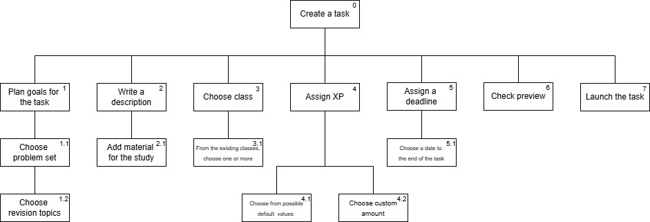
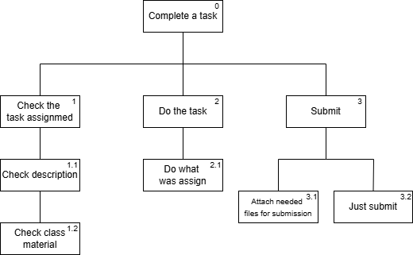
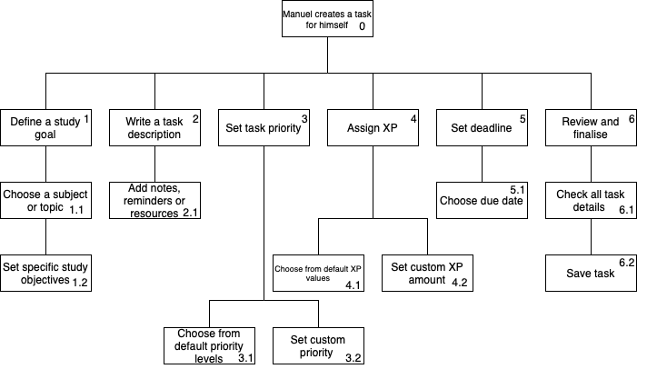

[Back to main Logbook Page](../hci_logbook.md)

---
# C. Requirement Definition
>	Based on all the gathered context, including an understanding of current practices, competitors, and user feedback and expectations: 
>	- summarize the user characteristics, context, and motivations using Personas
>	- explain your vision for a novel solution that will target user motivations using Scenarios
>	- identify requirements

# Personas

## Persona: Manuel Antunes 
### Summary 
| Attribute        | Details                                       |
| ---------------- | --------------------------------------------- |
| **Photo**        |   |
| **Name**         | Manuel Antunes                                |
| **Age**          | 20                                 |
| **Occupation**   | Student at the University of Aveiro                           |
| **Location**     | Aveiro, Portugal                               |
| **Goals**        | Improve marks and productivity through task management, stay organized, and keep up with lectures/assignments.           |
| **Pain Points**  | Procrastination, lack of motivation, and difficulty prioritizing tasks.              |
| **Motivation**   | "I need a way to stay motivated and organized, so I don’t fall behind on assignments and exam prep. If studying felt more engaging, I’d probably be more consistent."                |
| **Full Profile** | [📄 Read More](personas/persona1_template.md) |

---
## Persona: Joana Magalhães 
### Summary 
| Attribute        | Details                                       |
| ---------------- | --------------------------------------------- |
| **Photo**        |             |
| **Name**         | Joana Magalhães                                |
| **Age**          | 38                                 |
| **Occupation**   | High School Teacher                           |
| **Location**     | Porto, Portugal                               |
| **Goals**        | Develop good study habits in students through competitive strategies and ensure consistent study routines.           |
| **Pain Points**  | Students often forget homework and participation in class is low.              |
| **Motivation**   | "If I can make studying feel rewarding, my students will stay engaged and develop good habits. But I need a tool that’s simple and easy to manage without taking too much time from my teaching."                |
| **Full Profile** | [📄 Read More](personas/persona2_template.md) |

---
## Persona: Leonor Ferreira 
### Summary 
| Attribute        | Details                                       |
| ---------------- | --------------------------------------------- |
| **Photo**        |             |
| **Name**         | Leonor Ferreira                                |
| **Age**          | 16                                 |
| **Occupation**   | High School Student                           |
| **Location**     | Porto, Portugal                               |
| **Goals**        | Obtain a good average for university applications, earn rewards through competition, and prepare efficiently for tests.           |
| **Pain Points**  | Struggles with procrastination and finds studying boring and difficult to stay consistent with.              |
| **Motivation**   | "If studying felt more like a game, I wouldn't procrastinate as much. Seeing my progress and competing with my friends would make learning so much more fun and certainly would keep me on track."               |
| **Full Profile** | [📄 Read More](personas/persona3_template.md) |

---

# Hierarchical task analysis

## Breaking down user actions
Alongside the SWOT analysis, we also conducted an analysis to the main user actions in the system to be developed. Bellow we present the  digrams that describe those actions.

### Joana creates a task for her students
 

### Leonor completes a task
 

### Manuel creates a task for himself
 

# Scenarios

## Scenario 1: Manuel Prepares for an Exam

Manuel had an important exam coming up, but he often found it difficult to stay on track with his studies. He wanted to create a structured plan that would help him cover all the material efficiently while keeping him motivated. To achieve this, he turned to the **LearnQuest app** to organize his study sessions.

Opening the app, Manuel started by breaking down his syllabus into manageable tasks. He assigned different **priority levels** to each topic—quick reviews for concepts he already understood and deep study sessions for more challenging material. To make studying feel more rewarding, he set **XP rewards** for each task based on difficulty.

As the days passed, Manuel tracked his daily progress using the **streak system**, ensuring he stayed consistent. Whenever he completed a task, the app provided a small boost of encouragement and updated his XP count. Seeing his name on the **leaderboard** alongside his friends kept him engaged, pushing him to stay ahead and not fall behind.

During his study breaks, Manuel checked the **task overview** to see which topics still needed attention. He also received occasional **study tips** from the app, which helped him refine his approach. By the time the exam week arrived, Manuel felt more prepared than ever—his structured plan had transformed studying from a stressful chore into a gamified challenge he was determined to complete.

## Scenario 2: Joana Encourages Consistent Study Habits

As a dedicated teacher, Joana always looked for ways to keep her students engaged and motivated. She knew that **consistent study habits** were key to their success, but many of them struggled with procrastination. To address this, she turned to **LearnQuest** to introduce a structured and gamified approach to studying.

At the beginning of the week, Joana **created a study challenge** in the app, assigning tasks that would help her students prepare for upcoming lessons and exams. She set clear objectives and adjusted XP rewards based on difficulty, ensuring that students had a mix of manageable and more challenging goals.

Throughout the week, Joana used the app’s **tracking features** to monitor student progress. She checked the **leaderboard** and individual XP gains to see who was staying consistent and who might need extra encouragement. When she noticed a student falling behind, she sent them a friendly **motivational message** through the app, reminding them of the benefits of staying on track.

By the end of the challenge, Joana reviewed the rankings and celebrated the students who had completed their tasks. To keep the competition fun and engaging, she introduced **real-life rewards**, such as small prizes or classroom privileges, reinforcing the value of consistent effort. Seeing her students more engaged and motivated, Joana felt that LearnQuest had transformed studying from a tedious obligation into a fun and rewarding experience.

## Scenario 3: Leonor Overcomes Procrastination Through Gamified Study Challenges

Leonor had always found math challenging, and with a big test coming up, she kept putting off studying. No matter how many times she told herself to start, she struggled to find the motivation. Fortunately, her teacher, Joana, had assigned a **study challenge** on LearnQuest, breaking the material into manageable daily tasks.

One evening, Leonor **logged into the app**. She immediately noticed how her **progress bar** filled up and the XP she had earned over the past week. Scrolling through the leaderboard, she saw that her friend was ahead of her in points. Determined not to fall behind, she decided to complete an extra study task to **gain more XP** and close the gap.

As the days went by, Leonor found herself studying consistently without feeling overwhelmed. The **gamified elements**—tracking her progress, earning rewards, and competing with her classmates—transformed studying from a frustrating chore into an engaging challenge.

By the end of the week, Leonor checked her stats once again. She was surprised to see how much she had accomplished. Watching her **XP increase** and her **ranking improve** made her feel proud of her effort. More importantly, she realised she was finally prepared for the test—all without the usual last-minute panic.

---

# Requirements

## C.1. Functional requirements
**User Registration and Authentication**

- The system must allow users (students and teachers) to create an account and log in, in a secure way;
- Teachers should have admin privileges;

**Task and challenge management**

- Users should be able to create, edit and delete tasks;
- The system should alert students when a task in a study challenge is modified;
- The system should allow users to prioritise tasks and set difficulty levels;
- Teachers should be able to assign tasks / challenges and track their student’s progress;

**Gamification features**

- Users should be able to earn XP through task completion, track streaks and view leaderboards;
- The system must support reward mechanics (e.g virtual badges);

**Progress tracking and analytics**

- The system must provide a dashboard showing XP, progress bars, and completed tasks.
- Users should be able to view personal statistics and improvement trends over time.

**Notifications and reminders**

- The system must send reminders for pending tasks and challenges deadlines;
- The system must alert when users receive a new message;
- Users should receive notifications about leaderboard updates and streak milestones;

**Social and collaborative Features**

- Students should be able to compare their progress with classmates;
- Users must be able to create or join existing clans;
- Users must be able to create collaborative tasks within a clan;
- Users must be able to add and remove people to a clan;

## C.2. Non-functional requirements
**Usability**

- The interface must be intuitive and easy to use for both students and teachers.
- The app should provide accessibility features (e.g., color contrast, screen reader compatibility).

**Performance and scalability**

- The system should handle multiple users simultaneously without lag.
- The leaderboard and progress tracking should update in real time.

**Security and data privacy**

- User data (including progress and login details) must be stored securely

**Cross-Platform Compatibility**

- The application should run independently of device type;
- Users should be able to sync their progress no matter the device being used;

---
[Back to main Logbook Page](hci_logbook.md)