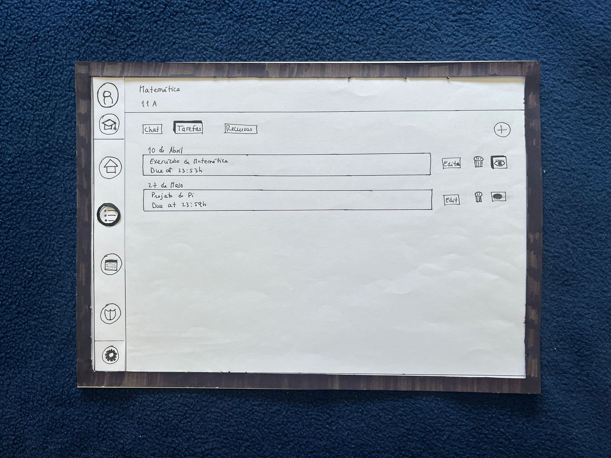

[Back to main Logbook Page](../hci_logbook.md)

---

# Low Fidelity Prototype and Evaluation

## D.1. Low Fidelity Prototype

### Purpose  
The low fidelity prototype was developed to explore early design ideas for *LearnQuest*. The goal was to gather initial feedback on the layout, navigation, and overall user flow.

### Tools Used  
We created the low fidelity prototype using pen-and-paper sketches of the main screens of our application.

### Key Screens
The prototype included screens for all of the different purposes of the app:
- **Personal**
  - A home screen with the user's avatar and XP level, badges, a chart showing progress over the year and a leaderboard.
  
  - A task dashboard screen where the user can create new tasks, new projects and select different ways to see them.
  
  - A calendar view where the user can see all of the existing tasks for a given month.
  
  - A clan home page view where users can check some stats on their clan.
  
  - A clan leaderboard view where users can check the clan ranking compared to other clans.
  
  - A clan members page where users can check all of the members that belong to their clan.
  
  - A clan chat page where users can send messages to other members of the clan.
  

- **Academic Student**
  - A home screen with the user's avatar and XP level, badges, a chart showing progress over the year and a leaderboard.
  
  - A task dashboard screen where the user can see the assigned tasks by their teacher.
  
  - A task details screen where the user can see all of the details of a given task such as the XP, the details, additional instructions, reference materials and files that will be sumbitted with the task. The user can also use this screen to submit tasks.
  
  - A calendar view where the user can see all of the existing tasks for a given month.
  
  - A clan home page view where users can check some stats on their clan.
  
  - A clan leaderboard view where users can check the clan ranking compared to other clans.
  
  - A clan members page where users can check all of the members that belong to their clan.
  
  - A clan chat page where users can send messages to other members of the clan.
  

- **Academic Teacher**
  - A home screen with the user's avatar, a chart showing progress over the year for a given class and a leaderboard with all their different classes active at the moment.
  
  - A classes view where the user can create new classes.
  
  - A classes creation view where the user can fill a form to create a new class.
  
  
  
  - A specific class view where the user can chat with all the students previously added in that class, assign and create new tasks and attach resources.
  
  
  
  - A calendar view where the user can see all of the existing tasks for a given month.
  
  - A chat screen where the user can send messages to their students
  

### All screens

### Design Features
- **Navigation Side Bar** with icons for Home, tasks, classes, etc.
- **Gamification Elements** such as badges, XP, and progress bars.
- **Minimal Text with Visual Icons** to reduce cognitive load.

---

## D.2. Prototype Evaluation

### Method  
We conducted a **formative evaluation** of the prototype with 3–5 users using:
- **Think-Aloud Protocol**: Participants verbalized their thoughts as they interacted with the prototype.
- **Task-Based Testing**: Users were asked to complete specific tasks for the 3 different app views:
  - **Personal**
    - Create a task for project 3 with priority: urgent, xp = 300 and due date = today;
    - Complete the task "HCI low fidelity prototype" under project1;
    - Check the upcoming tasks on the calendar view;
    - Check the clan leaderboard;
  - **Academic -Student**
    - Check all the pending tasks;
    - Submit the maths task;
  - **Academic -Teacher**
    - Create a new class with the following set of characteristics: course = Science; school year= 11; class= A; subject= maths;
    - Create a new task (open to the user) under the maths class just created;

- **Short Interview/Survey**: Collected feedback about usability, clarity, and visual appeal.

### Key Findings  
- **Navigation**: Users appreciated the intuitive layout but suggested making a different side bar for the teacher (with different icons) and the strong differentiation between the personal and academic use.
- **Gamification**: Positive feedback on the XP and progress system.
- **Visuals**: Some icons were unclear, leading to minor confusion; we improved these in the high fidelity prototype.
- **Feedback (all gathered)**: 
  - Users mentioned the student and teacher views should have different side bars in the academic mode.
  - Users mentioned we should make a strong differentiation when we are in the personal vs the academic mode.
  - Users mentioned we should have labels on all the icons present in the side bar.
  - Users mentioned that the home page had to much information cluttered together. They suggested we made it sparser.

### Changes Made  
- Added labels under icons for clarity.
- Developed a brand new Side bar for the Teacher's academic mode.
- Implemented a switch that clearly differentiates academic mode from personal mode.
- Sparsed the information on the home page to lower cognitive load.

---

[Back to main Logbook Page](../hci_logbook.md)
