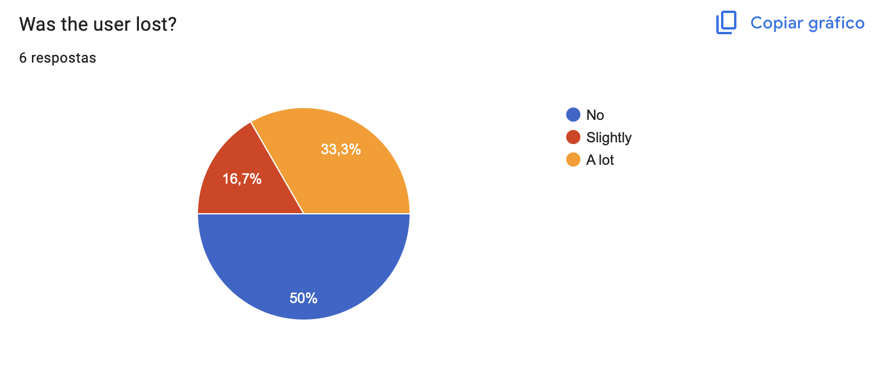
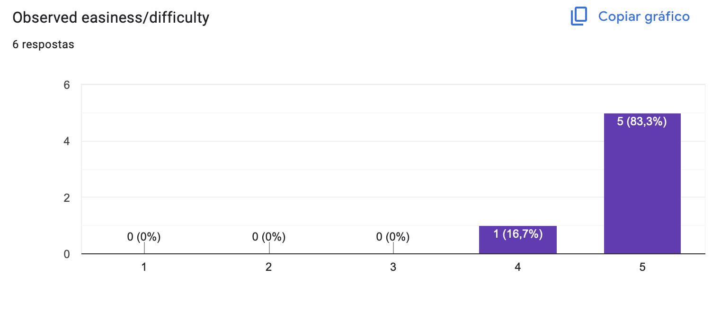

[Back to main Logbook Page](../hci_logbook.md)

---

# E. Functional Prototype and Evaluation

## Prototype

### Overview  
The functional prototype of **Learn Quest** is a fully working web application designed to support gamified learning through task completion and breakdown, progress tracking, and rewards. The app allows users to breakdown their goals into smaller tasks, complete them and monitor their performance over time.

### Key Features  
- **Gamification System**: XP, achievements, clans and progress bars enhance motivation.
- **Progress Tracking**: Experience points (XP), levels and badges.
- **Task management**: Different views (per month -calendar, per project -task board) on task breakdown and completion.
- **Student-Teacher compatability**: Teachers post quests for students to complete and earn XP.

### Technologies Used  
- **Frontend**: React and Tailwind CSS
- **Backend/Storage**: LocalStorage

### Design Evolution  
Based on feedback from the low-fidelity prototype, we:
- Added labels under icons for clarity.
- Developed a brand new Side bar for the Teacher's academic mode.
- Implemented a switch that clearly differentiates academic mode from personal mode.
- Sparsed the information on the home page to lower cognitive load.

---

## E.X. User Evaluation

### Evaluation Setup  
We conducted user testing with **6 participants**, all of whom were university students aged 19–20. Each participant was asked to complete a series of tasks for each view of the app:
- **Personal**
  1. Create a new Task related to Project IHC with priority urgent, xp = 300 and due date today.
  2. Complete the task "ihc lofi prototype" under IHC Project.
  3. Check all of the Tasks set in April in the Calendar View.
  4. Check which clan is in first place in the Clan Leaderboard.

- **Academic -Student**
  1. Check current pending tasks.
  2. Submit the Math task.

- **Academic -Teacher**
  1. Create a new class with the following characteristics: Science area, class 11a and subject Maths.
  2. Create a new task under the Math Class previously created

Evaluation methods included:
- **Think-Aloud Protocol**: making the user think aloud whilst completing the tasks.
- **Observation and Notes**: one team member observed the user and completed a survey with the following questions for each task:
  - Did the user complete the task?
  - Did the user completed the task correctly?
  - Max time observed (mins:secs).
  - Number of errors?
  - Was the user lost?
  - Did the user ask for help?
  - If the user asked for help what did they asked for?
  - Observed easiness/difficulty

- **Post-Test Survey**: SUS Questionnaire and Usability Test questionnaire

### SUS Questionnaire -setup
As part of post-testing sureveys we asked the users to answer a simple SUS Questionnaire with the following data collection:
- **Demographic data**
  1. Gender.
  2. Age.
  3. Level of Education (currently enrolled in).
  4. Previous experience with this type of application (e.g. Notion, Todoist, Jira).
  5. Observation section for any facts the user thought to be relevand for this test.

- **The actual set of questions** - 1-5 Likert Scale with 1 being "Totaly disagree" and 5 "Totaly agree"
  1. I think that I would like to use this system frequently.
  2. I found the system unnecessarily complex.
  3. I thought the system was easy to use.
  4. I think that I would need the support of a technical person to be able to use this system.
  5. I found the various functions in this system were well integrated.
  6. I thought there was too much inconsistency in this system.
  7. I would imagine that most people would learn to use this system very quickly.
  8. I found the system very cumbersome to use.
  9. I felt very confident using the system.
  10. I needed to learn a lot of things before I could get going with this system.
  11. A section for any obervations or feedback the user thought to be relevant

### SUS Questionnaire -findings
**Demographic Data**
1. Gender.

2. Age.

3. Level of Education (currently enrolled in).

4. Previous experience with this type of application (e.g. Notion, Todoist, Jira).

5. Observation section for any facts the user thought to be relevand for this test: Nothing to add by any users

**The actual set of questions**
1. I think that I would like to use this system frequently.

2. I found the system unnecessarily complex.

3. I thought the system was easy to use.

4. I think that I would need the support of a technical person to be able to use this system.

5. I found the various functions in this system were well integrated.

6. I thought there was too much inconsistency in this system.

7. I would imagine that most people would learn to use this system very quickly.

8. I found the system very cumbersome to use.

9. I felt very confident using the system.

10. I needed to learn a lot of things before I could get going with this system.

11. A section for any obervations or feedback the user thought to be relevant: Create a new view on the personal task board ("To-do") where all non-completed tasks go and let the "All" view have even the completed tasks.

### Usability Testing questionnaire -setup
In order to have a solid understanding of how users felt whilst using our system we conducted a post-test Usability Testing questionnaire regarding each task they were asked to complete. Every task had a 1-5 Likert Scale in which 1 stood for "Very difficult" and 5 stood for "Very easy".

### Usability Testing questionnaire -findings
- **Personal**
  1. Create a new Task related to Project IHC with priority urgent, xp = 300 and due date today.
  
  2. Complete the task "ihc lofi prototype" under IHC Project.
  
  3. Check all of the Tasks set in April in the Calendar View.
  
  4. Check which clan is in first place in the Clan Leaderboard.
  

- **Academic -Student**
  1. Check current pending tasks.
  
  2. Submit the Math task.
  

- **Academic -Teacher**
  1. Create a new class with the following characteristics: Science area, class 11a and subject Maths.
  
  2. Create a new task under the Math Class previously created
  

### Observer Questionnaire -setup
For each task evaluated we collected a set of data regarding how the observer noticed the user throughout the completion. Here is the set of questions put together:
  1. Did the user complete the task?
  2. Did the user completed the task correctly?
  3. Max time observed (mins:secs).
  4. Number of errors?
  5. Was the user lost?
  6. Did the user ask for help?
  7. If the user asked for help what did they asked for?
  8. Observed easiness/difficulty. (Likert scale in which 1 stood for "Very difficult" and 5 for "Very easy")

### Observer Questionnaire -findings
- **Personal**
  1. Create a new Task related to Project IHC with priority urgent, xp = 300 and due date today.
  
  
  
  
  
  
  If the user asked for help what did they asked for?: where to add the task; where the projects were located; where the project creation part was
  

  2. Complete the task "ihc lofi prototype" under IHC Project.
  
  
  
  
  
  
  

  
  3. Check all of the Tasks set in April in the Calendar View.
  
  
  
  
  
  
  

  4. Check which clan is in first place in the Clan Leaderboard.
  
  
  
  
  
  
  

- **Academic -Student**
  1. Check current pending tasks.
  
  
  
  
  
  
  

  2. Submit the Math task.
  
  
  
  
  
  
  

- **Academic -Teacher**
  1. Create a new class with the following characteristics: Science area, class 11a and subject Maths.
  
  
  
  
  
  
  

  2. Create a new task under the Math Class previously created
  
  
  
  
  
  
  

### Key Findings  
- **Strengths**:
  - Users liked the gamification elements (XP, badges).
  - The visual design was perceived as simple and functional.
  - Navigation was mostly clear and consistent.

- **Weaknesses**:
  - One user did not immediatly understand where the tasks in the personal mode were located.
  - Most users had trouble finding the HCI project that was located in the "Done" section

### Metrics (Selected Results)  
**SUS Score**
- User 1: 77.5 (Good)
- User 2: 97.5 (Excelent)
- User 3: 82.5 (Excelent)
- User 4: 100 (Excelent)
- User 5: 97.5 (Excelent)
- User 6: 92.5 (Excelent)

### Improvements Considered  
- We created a new view on the personal task board ("To-do") where all non-completed tasks are shown and let the "All" view have even the completed tasks.

---

[Back to main Logbook Page](../hci_logbook.md)