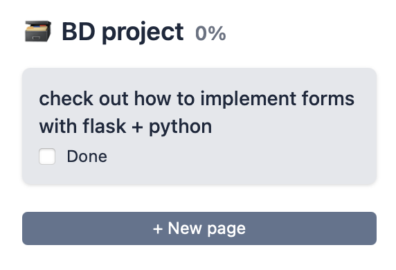
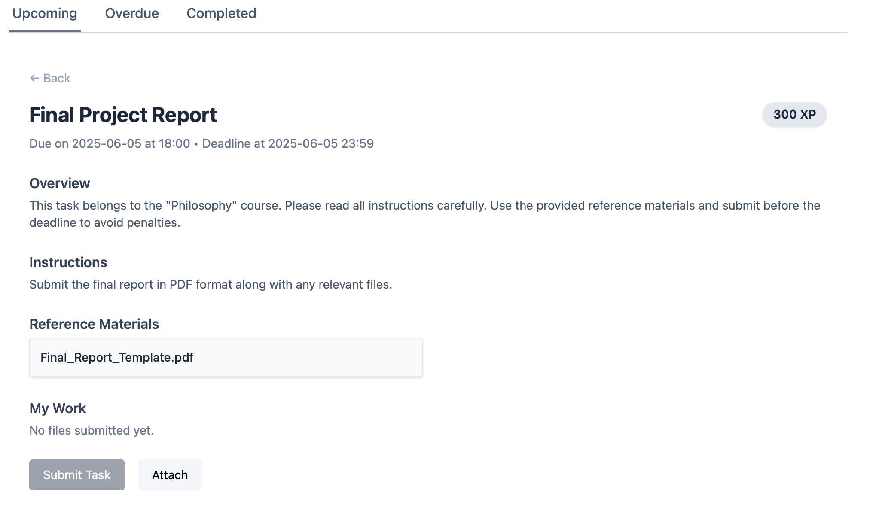
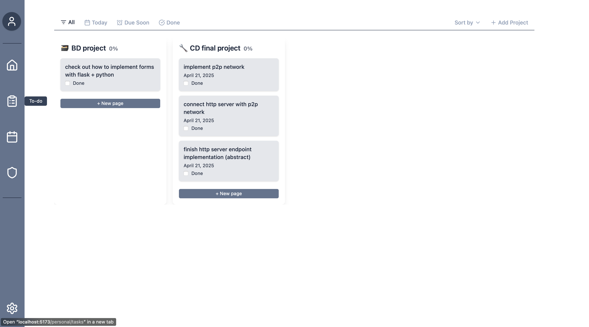

[Back to main Logbook Page](../hci_logbook.md)

---

# F. Discussion of Evaluation Results

The high-fidelity prototype was evaluated by a group of 6 potential users. Overall, they responded positively to the visual layout, task flow, and gamification elements. However, several usability issues and improvement opportunities emerged:

- **Terminology confusion:** Users found the term "new page" unclear in the context of task creation. "New task" was suggested as a clearer label.

- **Button layout:** In the student's academic view, the placement of the "Attach" and "Submit" buttons felt unintuitive.

- **Visual clarity:** The task board label needed clearer naming to make navigation more intuitive.

---

# Refinement List
Based on user feedback, the following changes were made:

- Changed label “new page” to **“new task”** in the personal's task board view.
- Move the **Attach button above the Submit button** in the student's task view.
- Display user **avatars** in the personal view for visual consistency.
- Rename the **leaderboard on the Home page** from the teacher's home view to **"Classes**.
- Change the teacher's personal view for the to display “Joana” instead of a generic placeholder.
- Update **Joana’s personal data** to ensure it’s unique and not duplicated from other users.
- Add functionality for the teacher to **view individual student submissions** per class.
- Rename task icon label to **“Tasks”** for clarity.
- Create a new tab in the task board's filter bar for **To Do** projects (shows all tasks not marked as done).
- Redesign the **All** tab in the task board's filter bar to include both active and completed tasks.

---

# Refined Prototype - PICTURES AND VIDEO

Following the evaluation, the prototype was refined to address the most urgent usability issues pointed out in the high fidelity prototype evaluation

---

[Back to main Logbook Page](../hci_logbook.md)
